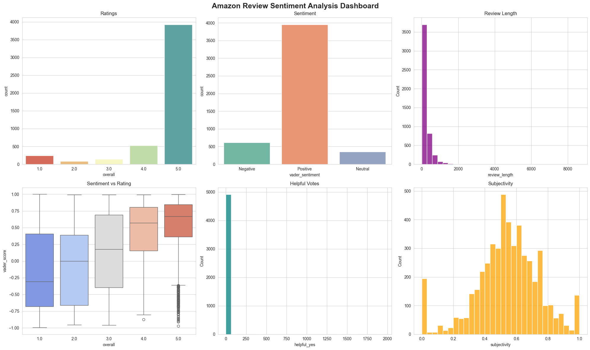
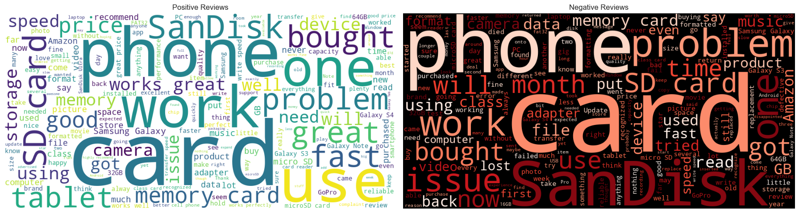
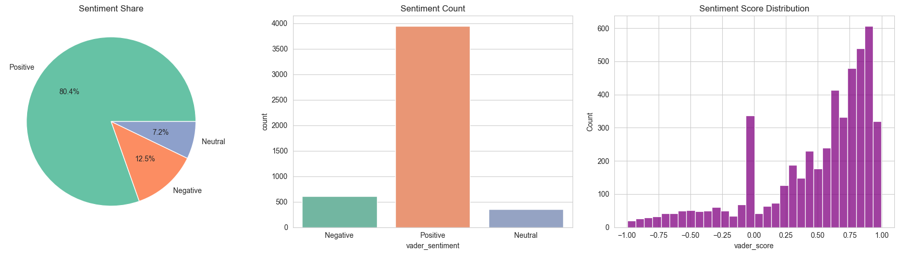

# What Are Customers Really Saying? 📊

## Amazon Review Sentiment Analysis

This project explores Amazon customer reviews using Natural Language Processing (NLP), Sentiment Analysis, and Data Visualization techniques to uncover customer opinions, satisfaction trends, and review behavior.

The analysis combines VADER and TextBlob sentiment models to evaluate customer feedback and generate actionable business insights.

---

##  Project Overview

Customer reviews contain valuable information about product quality, customer satisfaction, and user experience.

This project aims to answer key questions such as:

- What is the distribution of customer ratings?
- What sentiments dominate customer reviews?
- How do ratings relate to sentiment?
- Are helpful reviews more positive or negative?
- How does review length impact helpfulness?
- How consistent are VADER and TextBlob sentiment models?

---

##  Dashboard Preview




---

##  Analyses Performed

### 1. Data Cleaning & Preprocessing
- Missing value handling
- Date conversion
- Feature engineering
- Review length calculation
- Word count extraction

### 2. Exploratory Data Analysis (EDA)
- Dataset overview
- Statistical summary
- Rating distribution
- Review behavior analysis

### 3. Sentiment Analysis
- VADER Sentiment Scoring
- TextBlob Sentiment Scoring
- Sentiment Classification
- Sentiment Distribution Analysis

### 4. Rating vs Sentiment Analysis
- Rating distribution by sentiment
- Sentiment score comparison
- Heatmap analysis

### 5. Subjectivity Analysis
- Subjectivity distribution
- Polarity vs Subjectivity relationship
- Subjectivity across ratings

### 6. Word Analysis
- Positive Review Word Cloud
- Negative Review Word Cloud
- Top Positive Words
- Top Negative Words

### 7. Review Length Analysis
- Review length distribution
- Review length by sentiment
- Review length by rating

### 8. Helpfulness Analysis
- Helpful votes distribution
- Helpful votes by sentiment
- Review length vs helpful votes
- Wilson Lower Bound analysis

### 9. Trend Analysis
- Reviews over time
- Average ratings over time
- Average sentiment over time

### 10. Model Agreement Analysis
- VADER vs TextBlob comparison
- Correlation analysis
- Agreement heatmap
- Agreement percentage

### 11. Executive Dashboard
- Combined visual analytics dashboard
- Key performance indicators
- Business insights summary

---

## 🛠 Technologies Used

- Python
- Pandas
- NumPy
- Matplotlib
- Seaborn
- TextBlob
- VADER Sentiment
- WordCloud
- Scikit-Learn
- Jupyter Notebook

---

## 📈 Key Findings

- Positive reviews dominate the dataset.
- Higher ratings strongly align with positive sentiment.
- Negative reviews tend to be longer and more detailed.
- Helpful reviews often contain richer customer experiences.
- VADER and TextBlob demonstrate strong agreement.
- Customer sentiment remains largely positive across time.

---

## 📂 Dataset Features

- Reviewer Name
- Rating (1–5 Stars)
- Review Text
- Review Date
- Helpful Votes
- Total Votes
- Wilson Lower Bound Score
- Review Helpfulness Metrics

---

## 🚀 Project Structure

```text
Amazon-Review-Sentiment-Analysis/
│
├── Amazon_Review_Sentiment_Analysis.ipynb
├── README.md
├── dashboard.png
└── dataset.csv
```

---

## 🎯 Project Goal

The goal of this project is to transform unstructured customer reviews into meaningful business insights using sentiment analysis, statistical exploration, and interactive visualizations.

---

## 👨‍💻 Author

**Muhammad Zohair Baloch**

Aspiring Data Analyst | AI Student | Kaggle Contributor

- GitHub: https://github.com/zohairbaloch-64
- Kaggle: https://www.kaggle.com/zohairbaloch

---

## ⭐ If you found this project useful, consider giving it a star.
